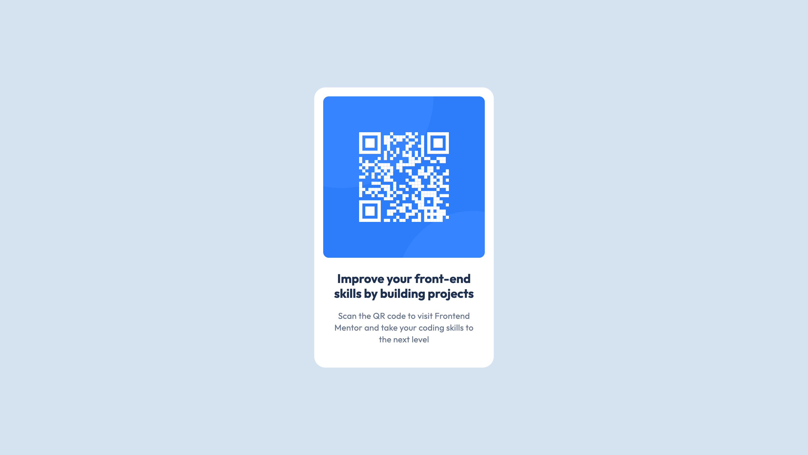

# Frontend Mentor - QR code component solution

This is a solution to the [QR code component challenge on Frontend Mentor](https://www.frontendmentor.io/challenges/qr-code-component-iux_sIO_H).

## Table of contents

- [Overview](#overview)
  - [Screenshot](#screenshot)
  - [Links](#links)
- [My process](#my-process)
  - [Built with](#built-with)
  - [What I learned](#what-i-learned)
- [Author](#author)
- [Acknowledgments](#acknowledgments)

## Overview

### Screenshot



### Links

- Solution URL: [Add solution URL here](https://github.com/BethiXSupraja/frontend-mentor-challenges/tree/main/qr-code-component)
- Live Site URL: [Add live site URL here](https://frontendmentorqr-code-component.netlify.app/)

## My process

### Built with

- Semantic HTML5 markup
- CSS custom properties for reusable color variables
- Flexbox for layout and centering
- Mobile-first workflow
- Google Fonts – Outfit typeface
- Responsive design principles

### What I learned

#### 1. Using CSS Custom Properties (`:root`) for Theming and Reusability

Defining colors as variables inside the `:root` selector allows me to maintain a consistent color scheme throughout the project. It also makes future updates easier — changing a single value updates the entire UI.

```css
:root {
  --white: hsl(0, 0%, 100%);
  --light-grey: hsl(212, 45%, 89%);
  --grey: hsl(216, 15%, 48%);
  --dark-blue: hsl(218, 44%, 22%);
}
```

Here, I declared four custom properties for colors. Using HSL lets me tweak lightness and saturation easily if needed.
Then, throughout the CSS, I reference these variables like so:

```css
body {
  background-color: var(--light-grey);
}

.card {
  background-color: var(--white);
  color: var(--dark-blue);
}
```

#### 2. Universal Reset and `box-sizing: border-box` for Consistent Layouts

To avoid default browser margin and padding inconsistencies, I reset all elements’ margin and padding to zero and set `box-sizing` to `border-box`. This ensures padding and border are included in the element’s total width and height — making sizing predictable.

```css
* {
  margin: 0;
  padding: 0;
  box-sizing: border-box;
}
```

This approach improves readability and maintainability, as colors are centrally managed.

#### 3. Centering with Flexbox

I used Flexbox on the `body` element to perfectly center the card component both vertically and horizontally.

```css
body {
  display: flex;
  align-items: center;
  justify-content: center;
  min-height: 100vh; /* full viewport height */
  font-family: "Outfit", sans-serif;
  background-color: var(--light-grey);
}
```

- `display: flex` activates Flexbox layout.
- `align-items: center` vertically centers children.
- `justify-content: center` horizontally centers children.
- `min-height: 100vh` ensures the body takes full viewport height for vertical centering.

This is a much cleaner and more flexible alternative to older centering methods using margins or absolute positioning.

#### 4. Using `overflow: hidden` to Respect Border Radius on Images

To make sure the card’s rounded corners also clip the image inside it, I combined `border-radius` with `overflow: hidden` on the `.card` container.

```css
.card {
  border-radius: 20px;
  overflow: hidden;
  background-color: var(--white);
  box-shadow: 0 25px 25px 0 hsla(0, 0, 0, 0.0477);
  width: 320px;
  padding: 16px 16px 40px;
  display: flex;
  flex-direction: column;
}
```

Without `overflow: hidden`, the image inside could spill out beyond the rounded corners. This technique keeps the visual shape clean without needing extra wrappers.
The image itself is styled to be full width inside the card:

```css
.card-image {
  width: 100%;
  display: block; /* removes inline spacing */
  /* No border-radius needed here because parent clips */
}
```

#### 5. Semantic HTML Structure for Accessibility and Clarity

The HTML is structured with semantic tags to ensure accessibility and clear document flow:

```html
<div class="card">
  
  <h2 class="card-title">Improve your front-end skills by building projects</h2>
  <p class="card-description">
    Scan the QR code to visit Frontend Mentor and take your coding skills to the
    next level
  </p>
</div>
```

- The image has an `alt` attribute for screen readers.
- The main heading uses `<h1>` for proper document outline.
- Paragraphs use `<p>` for textual content.
- The container `<div>` uses a class for styling but doesn't affect semantics.

## Author

- Website - [Supraja Bethi](https://react-portfolio-suprajabethi.netlify.app/)
- Frontend Mentor - [@BethiXSupraja](https://www.frontendmentor.io/profile/BethiXSupraja)
- LinkedIn - [@supraja-bethi](https://www.linkedin.com/in/supraja-bethi/)

## Acknowledgments

This project was completed independently.  
I’m proud to have challenged myself and applied what I’ve learned through self-study and practice.  
Thanks to the many online resources and tutorials that made this learning journey possible.
