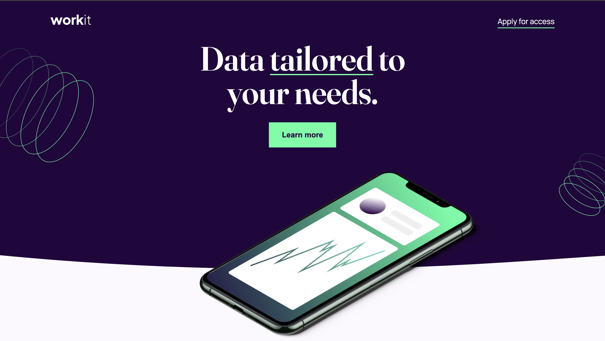
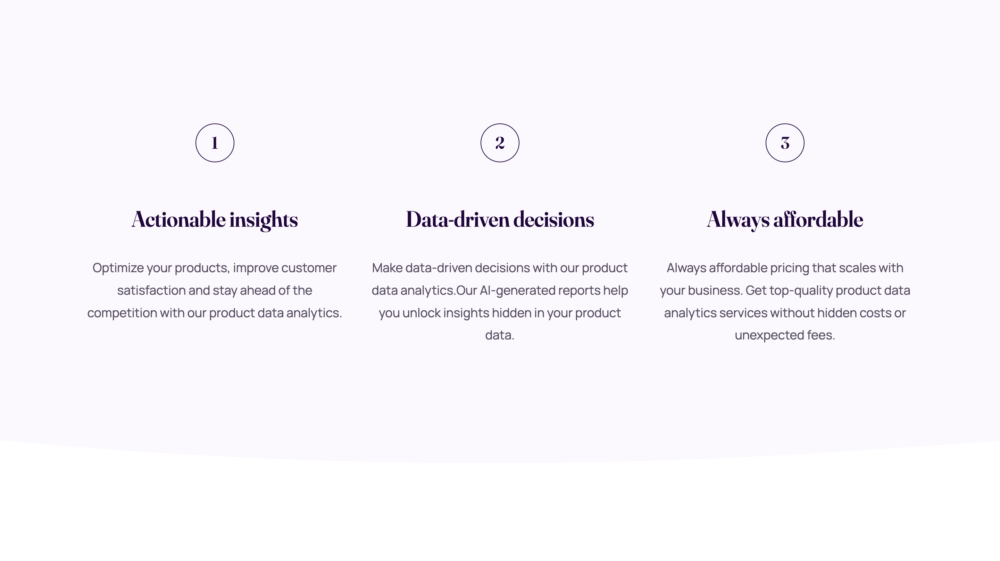
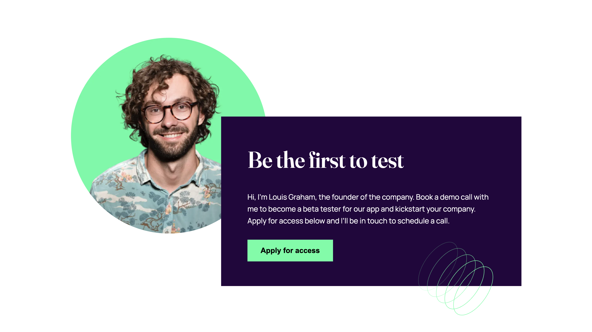
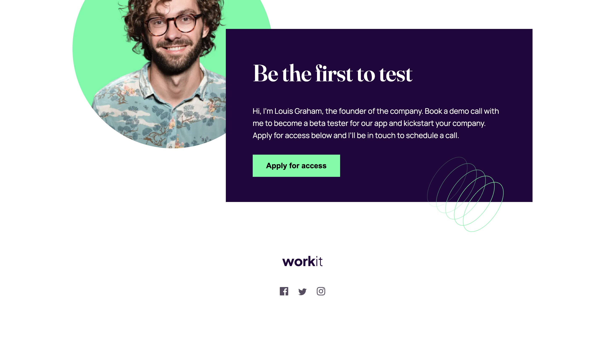

# Frontend Mentor - Workit landing page solution

This is a solution to the [Workit landing page challenge on Frontend Mentor](https://www.frontendmentor.io/challenges/workit-landing-page-2fYnyle5lu).

## Table of contents

- [Overview](#overview)
  - [The challenge](#the-challenge)
  - [Screenshot](#screenshot)
  - [Links](#links)
- [My process](#my-process)
  - [Built with](#built-with)
  - [What I learned](#what-i-learned)
  - [Continued development](#continued-development)
  - [Useful resources](#useful-resources)
- [Author](#author)
- [Acknowledgments](#acknowledgments)

## Overview

### The challenge

Users should be able to:

- View the optimal layout for the interface depending on their device's screen size
- See hover and focus states for all interactive elements on the page

### Screenshot






### Links

- Solution URL: [Add solution URL here](https://github.com/BethiXSupraja/frontend-mentor-challenges/tree/main/workit-landing-page)
- Live Site URL: [Add live site URL here](https://workit-web-landing-page.netlify.app/)

## My process

### Built with

- Semantic **HTML5** markup
- Modern **CSS**
  - Custom properties (CSS variables)
  - **Flexbox** for layout
  - **CSS Grid** for the values/cards section
  - Responsive, **desktop-first** media queries
- **SVG** wave dividers (inline)
- **Google Fonts**: Fraunces (variable, `"opsz"` axis) & Manrope

### What I learned

#### 1) Content-driven breakpoints (desktop-first)

I added media queries **just before** layouts started to break, instead of targeting devices.  
This kept the CSS smaller and easier to reason about.

```css
/* Desktop base */
.values-grid {
  grid-template-columns: repeat(3, 1fr);
}

/* Tablet: stack cards and switch internal layout */
@media (max-width: 1024px) {
  .values-grid {
    grid-template-columns: 1fr;
  }
  .value {
    grid-template-columns: 56px 1fr;
    text-align: left;
  }
}

/* Mobile: stack card content again and center */
@media (max-width: 768px) {
  .value {
    grid-template-columns: 1fr;
    text-align: center;
  }
}
```

#### 2) Grid inside each card for rock-solid alignment

Using CSS Grid inside the card keeps title/paragraph alignment consistent across columns.

```css
.value {
  display: grid;
  grid-template-rows: auto auto 1fr; /* number, heading, body that fills */
  justify-items: center;
}
```

#### 3) Switching the card’s grid template at breakpoints

On tablet view, the inner layout reshapes from a vertical stack into a two-column row (`[number | text]`).  
This keeps the number fixed in its own column while letting the text flex naturally.

```css
/* Tablet: number fixed column, text flexible */
@media (max-width: 1024px) {
  .value {
    grid-template-rows: none;
    grid-template-columns: 56px 1fr;
    justify-items: start;
    align-items: start;
  }
}
```

### 4) Inline SVG waves for perfect, scalable curves

Section dividers are implemented with inline SVGs.  
They scale crisply at any screen size and blend seamlessly with background colors.  
You can also theme them (light/dark) by adjusting the `fill` color.

```html
<div class="hero-curve">
  <svg viewBox="0 0 1200 120" preserveAspectRatio="none" aria-hidden="true">
    <path d="M321.39,56.44..." class="shape-fill"></path>
  </svg>
</div>
```

```css
.hero-curve {
  position: relative;
  width: 100%;
  overflow: hidden;
  line-height: 0; /* removes unwanted spacing */
}

.hero-curve svg {
  display: block;
  width: 100%;
  height: 100px; /* adjust as needed */
}

/* Default (dark theme) */
.shape-fill {
  fill: var(--n); /* or your section bg color */
}

/* ligth theme reuse*/
.shape-fill {
  fill: var(--lavender); /* or another contrasting accent */
}
```

### 5) Layering and overlap without breaking flow

Different techniques are used depending on the role of the element:

- **Section curves** use **absolute positioning** so they sit outside normal flow.
- **Portraits (founders, CTAs)** use **negative margins** to overlap the next section while still participating in flow.
- **Hero phone** uses **absolute positioning** for precise control and z-index layering.

This avoids brittle "magic numbers" and keeps layouts flexible.

```css
/* Curve divider — absolute, sits outside flow */
.hero-curve {
  position: absolute;
  top: 100%;
  left: 0;
  width: 100%;
  overflow: hidden;
  line-height: 0;
  margin-top: -1rem; /* smooth overlap */
}

/* Founders portrait — negative margins to overlap */
.founders-img {
  width: 477px;
  height: 477px;
  margin-right: -7rem;
  margin-top: -20rem; /* pulls upward into previous section */
}

/* Hero phone — absolute positioning for precise overlap */
.phone-img {
  display: block;
  width: 700px;
  position: absolute;
  top: 68%;
  left: 33%;
  z-index: 5;
}
```

### Continued development

- Reduce & consolidate breakpoints using Grid `minmax/auto-fit` and fluid type (`clamp()`).
- Try container queries to make components responsive to their own width.
- Improve a11y: focus states, skip links, color contrast, reduced-motion support.
- Optimize images (AVIF/WebP, `picture`, `loading="lazy"`).
- Tidy CSS with layers (`@layer`) and tokens in `:root`.

### Useful resources

- MDN: CSS Grid & Flexbox (clear, canonical docs)
- web.dev: Fluid typography & responsive images
- Smashing Magazine: Container Queries guides

## Author

- Website - [Supraja Bethi](https://react-portfolio-suprajabethi.netlify.app/)
- Frontend Mentor - [@BethiXSupraja](https://www.frontendmentor.io/profile/BethiXSupraja)
- LinkedIn - [@supraja-bethi](https://www.linkedin.com/in/supraja-bethi/)

## Acknowledgments

This project was completed independently.  
I’m proud to have challenged myself and applied what I’ve learned through self-study and practice.  
Thanks to the many online resources and tutorials that made this learning journey possible.
